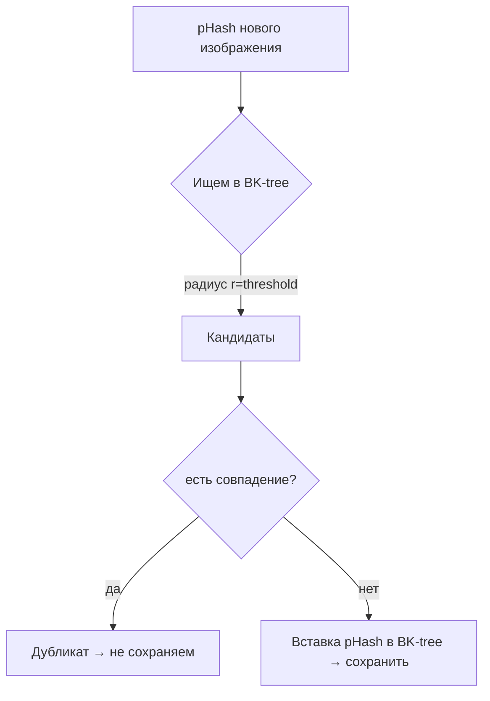
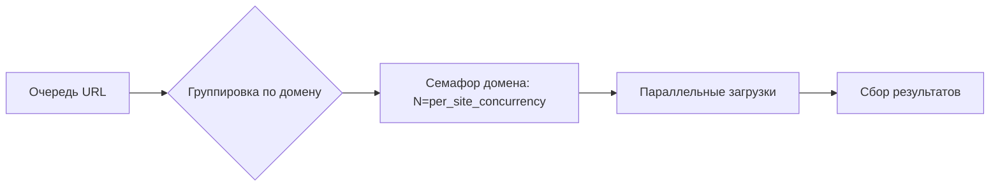
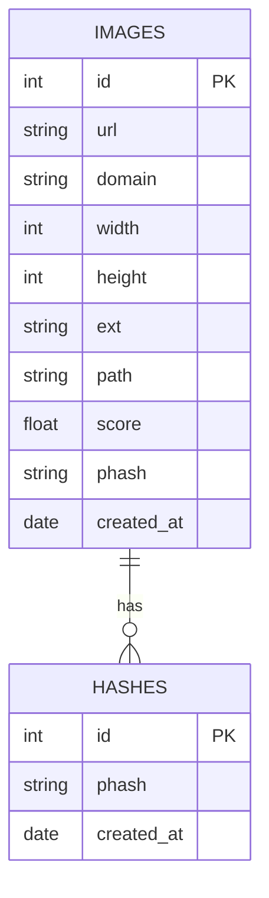

<div align="center">

# SnapCrawler 🕷️📸

<p>
  <a href="https://www.python.org"></a>
  <a href="https://docs.aiohttp.org/"></a>
  <a href="https://www.sqlite.org"></a>
  <a href="#license"></a>
  <a href="#"></a>
  <a href="#возможности"></a>
  
  <br/>
  <sub>Лёгкий асинхронный краулер для сборки датасетов реальных фотографий • pHash dedup • опц. ONNX‑классификатор</sub>
</p>

</div>

Лёгкий CPU‑дружелюбный краулер для сбора датасета реальных фотографий. Умеет глубоко парсить страницы, предпочитает крупные изображения, бережно относится к сайтам, поддерживает дедупликацию по pHash (BK‑tree) и опциональный ONNX‑классификатор.

<details>
<summary><b>Содержание</b></summary>

- [Возможности](#возможности)
- [Установка](#установка)
- [Запуск](#запуск)
- [Настройка](#настройка)
- [Как это работает](#как-это-работает)
- [Рекомендуемые настройки](#рекомендуемые-настройки-под-большую-выгрузку)
- [Производительность](#производительность-и-непалевность)
- [FAQ](#faq)
- [Roadmap](#roadmap)
- [Лицензия](#license)

</details>

## Возможности
- Конфиг YAML: `config.yaml` (с русскими комментариями)
- CLI: `python spider.py [start|status|pack|clean|check]`
- SQLite‑БД: метаданные и хэши в `<storage_path>/snapcrawler.sqlite3`
- Упаковка датасета: zip/tar
- Логирование: консоль + файл `snapcrawler.log`
- Глубокий парсинг (BFS) по домену до настраиваемой глубины
- Пер‑доменная конкуренция и Circuit Breaker для «стелс»‑режима
- Дедуп по pHash с BK‑tree для быстрых «похожих» совпадений
- Фильтры качества: размер, ориентация, BW, водяные знаки (URL/пиксели)

## Почему SnapCrawler
- __Простота__: один `config.yaml`, одна команда — поехали.
- __Качество__: ищет именно «оригиналы» и крупные изображения; фильтрует превью и водяные знаки.
- __Масштаб__: BK‑tree для быстрых «похожих» дубликатов; устойчив к росту до сотен тысяч файлов.
- __Вежливость__: пер‑доменные лимиты, задержки, Circuit Breaker.

### Матрица возможностей

| Возможность | Статус | Детали |
|---|---|---|
| BFS глубокий парсинг | ✅ | В домене до `download.deep_max_depth`, `` + умные `<a>` (original/download) |
| Пер‑доменная конкуренция | ✅ | `download.per_site_concurrency` + общий `threads` |
| Дедупликация pHash | ✅ | BK‑tree, порог `deduplication.hamming_threshold` |
| Фильтр водяных знаков | ✅ | URL‑ключевые слова + опц. пиксельная эвристика |
| Сохранение JPEG/Original | ✅ | `image.save_format`, `image.jpeg_quality`, `image.extensions` |
| Классификатор ONNX | ✅ (опц.) | Авто‑отключается, если модель недоступна |
| Прокси/авто‑дискавери | 🟨 (зарезерв.) | Параметры в конфиге, реализация отложена |


## Установка
```bash
python -m venv .venv
.venv\Scripts\pip install -r requirements.txt
```

### Как работает BK-tree (поиск похожих pHash)



### Пер‑доменная конкуренция



### ER‑диаграмма БД (упрощённо)



## Запуск
- Показать статистику БД:
```bash
python spider.py status
```
- Упаковать датасет (zip по умолчанию):
```bash
python spider.py pack
```
- Старт краулинга:
```bash
python spider.py start
```

- Очистка датасета от не‑фото (ИИ/арт) по уже скачанным файлам:
```bash
python spider.py clean
```

- Самотест проекта (подробный отчёт PASS/FAIL):
```bash
python spider.py check
```

> Совет: сначала запустите `check`, затем `start`. Для отладки включайте лог `snapcrawler.log`.

## Быстрый старт
```bash
git clone <repo>
cd SnapCrawler
python -m venv .venv
.venv\Scripts\pip install -r requirements.txt
python spider.py check         # самотест
python spider.py start         # старт краулинга
python spider.py status        # статистика
python spider.py pack          # упаковка архива
```
Минимально отредактируйте `config.yaml`: добавьте свои источники в `download.sources`.

## Как это работает

```mermaid
flowchart LR
    A[Источники (download.sources)] --> B{Сбор URL}
    B -->| src/srcset| C[Кандидаты картинок]
    B -->|<a> original/download| C
    B -->|BFS до deep_max_depth| B
    C --> D[aiohttp загрузка]
    D --> E{preprocess}
    E -->|min_side, ориентация, BW| F[pHash]
    E -->|опц. pixel watermark| F
    F --> G{дедуп (BK-tree)}
    G -->|новое| H[Сохранение JPEG/Original]
    H --> I[(SQLite метаданные)]
    I --> J{auto_pack?}
    J -->|да| K[pack]
```

## Конфигурация (быстрый обзор)

| Ключ | Описание |
|---|---|
| `download.sources` | Стартовые страницы с ``/ссылками |
| `download.deep_parsing` | Включить BFS‑обход по домену |
| `download.deep_max_depth` | Максимальная глубина BFS |
| `download.threads` | Общий параллелизм загрузок |
| `download.per_site_concurrency` | Одновременные запросы на домен |
| `download.request_delay` | Задержка+джиттер между запросами |
| `image.min_side` | Минимальная сторона изображения |
| `image.save_format` | `jpeg` или `original` |
| `image.extensions` | Допустимые форматы при `original` |
| `image.skip_watermarked_urls` | Пропуск URL с водяными знаками |
| `image.watermark_pixel_filter.enable` | Опц. пиксельная эвристика |
| `deduplication.hamming_threshold` | Порог похожести pHash |


## Настройка
Все параметры описаны в `config.yaml` (комментарии на русском).
- Источники для сбора: `download.sources`
- Ограничение параллелизма: `download.threads`
- Фильтр по размеру: `image.min_side`
- Классификатор (опц.): `classifier.*` (если нет модели — отключите `enable: false`)
- Дедупликация pHash: `deduplication.*`
- Целевая величина датасета: `project.target_images`
- Пост‑фильтр: `postfilter.*` (сканирует уже скачанные изображения и удаляет не‑фото)

### Пресеты конфигурации

1) Медленно и вежливо (для «хрупких» сайтов):
```yaml
download:
  threads: 4
  per_site_concurrency: 1
  request_delay: 1.2
  deep_parsing: true
  deep_max_depth: 2
```

2) Быстро (на хорошей сети):
```yaml
download:
  threads: 8
  per_site_concurrency: 3
  request_delay: 0.4
  deep_parsing: true
  deep_max_depth: 3
```

3) Сверх‑чисто (антиводяной + оригинальные форматы):
```yaml
image:
  save_format: original
  extensions: [".jpg", ".jpeg", ".png", ".webp"]
  skip_watermarked_urls: true
  watermark_pixel_filter:
    enable: true
    band_ratio: 0.15
    edge_threshold: 25
    edge_density: 0.08
```

### Пример `postfilter` в config.yaml
```yaml
postfilter:
  enable: true           # включить пост‑фильтр
  use_classifier: true   # использовать ONNX модель (если доступна)
  threshold: 0.6         # комбинированный порог (модель+эвристика)
  dry_run: true          # сначала сухой прогон — только лог, без удаления
  scan_limit: 0          # 0 = без ограничений
```

Как это работает:
- Если доступна модель `classifier.model_path`, используется её скор (photo vs non‑photo).
- Всегда задействуется лёгкая эвристика (границы/вариативность) без нагрузки на GPU.
- Итоговый скор — взвешенная сумма (модель 70% + эвристика 30%). Если ниже `threshold`,
  файл удаляется (или логируется при `dry_run: true`).

## Производительность и непалевность
- Аппаратно: 2–4 CPU‑ядра, 2–4 GB RAM достаточно для стабильной работы.
- Параллелизм: начинайте с `download.threads: 4–6`, `per_site_concurrency: 2`.
- Вежливость: `request_delay` + джиттер, ротация `user_agents`, уважайте `robots.txt` (если включите у себя проверку).
- Circuit Breaker: помогает смягчать 429/5xx; не отключайте на продуктивных прогонах.
- Лимиты: `max_requests_per_site` защищает от «залипания» на одном домене.

### Бенчмарки (пример)

| Источники | Threads | Per‑site | Время (мин) | Скачано (штук) | Файлов/мин | RAM |
|---|---:|---:|---:|---:|---:|---:|
| 5 PD/CC0 доменов | 6 | 2 | 30 | 3 500 | 117 | ~700 MB |
| 10 доменов | 8 | 3 | 60 | 7 800 | 130 | ~1.1 GB |

Примечание: цифры зависят от сети/источников/фильтров и приведены как ориентиp.

## Структура
- `spider.py` — CLI‑точка входа (start/status/pack/clean/check)
- `project_check.py` — самотест проекта (подробный отчёт)
- `snapcrawler/` — код модулей (источники, пайплайн, БД, логика упаковки, утилиты)


## Структура проекта (дерево)
```text
SnapCrawler/
├─ spider.py                      # CLI: start / status / pack / clean / check
├─ project_check.py               # Самотест проекта (отчёт PASS/FAIL)
├─ config.yaml                    # Конфигурация проекта (RU-комментарии)
├─ requirements.txt               # Зависимости с пояснениями
├─ snapcrawler.log                # Лог файл (ротация включена)
├─ README.md
├─ dataset/                       # Папка хранения датасета
│  └─ snapcrawler.sqlite3         # SQLite база (создаётся автоматически)
└─ snapcrawler/                   # Исходный код модулей
   ├─ __init__.py
   ├─ logging_setup.py            # Настройка логирования
   ├─ config.py                   # Загрузка/валидация YAML‑конфига
   ├─ db.py                       # Работа с SQLite, статистика
   ├─ sources.py                  # Сбор ссылок на изображения из HTML
   ├─ pipeline.py                 # Асинхронный пайплайн обработки
   ├─ classifier.py               # ONNX‑классификатор (опционально)
   ├─ postfilter.py               # Пост‑фильтр датасета (эвристика + ONNX, при наличии)
   ├─ storage.py                  # Сохранение и учёт размера папки
   ├─ packing.py                  # Упаковка датасета (zip/tar)
   └─ utils.py                    # Вспомогательные функции
```

## Логическая структура (стрелочная диаграмма с развилками)
```text
CLI (spider.py)
      │
      ├── start
      │     │
      │     ▼
      │   load_config() → setup_logging() → Database.init() → pipeline.run()
      │                                               │
      │                                               ├─► достигнут project.target_images? — да → отмена оставшихся задач → завершение
      │                                               │
      │                                               ▼
      │              Сбор URL → Загрузка → Предобработка → Классификация → Дедупликация → Сохранение
      │                                               │
      │                                               └─► (если packing.auto_pack и превышен max_folder_size_mb) → совет упаковать
      │
      ├── status → БД-статистика (итоги, домены, даты)
      ├── pack   → Упаковка dataset (zip/tar)
      ├── clean  → Пост‑фильтр скачанных файлов (эвристика + ONNX, при наличии)
      └── check  → Самотест: окружение, конфиг, БД, предобработка+pHash, пост‑фильтр(dry‑run), упаковка, (опц.) сеть
      │
      │                 │
      │                 ▼
      │        есть URL → продолжить
      │
      │                      ▼
      │               Подготовка HTTP: aiohttp.ClientSession + Semaphore + CircuitBreaker
      │               iter_hashes() (для дедупликации) + попытка init Classifier
      │                 │
      │                 ▼
      │           Classifier.enable == true и модель доступна?
      │                 │
      │        ┌───────┴────────┐
      │        ▼                ▼
      │   classifier=ON        classifier=None
      │                 │
      │                 ▼
      │     Для каждого URL (ограничено threads и target_images):
      │                 │
      │                 ▼
      │             fetch_bytes()
      │                 │
      │     ┌── HTTP!=200 / не image/* ──┐
      │     │                            │
      │     ▼                            ▼
      │  cb.report(fail,code)     OK → data (bytes)
      │  backoff/retry≤3                 │
      │     │                            ▼
      │  [после ретраев 429?] ──► LOG.debug("получен 429") → return None
      │
      │                 ▼
      │        preprocess_image(data)
      │                 │
      │   ┌─ слишком мало / ориентация не подходит / BW запрещён ─┐
      │   │                                                        │
      │   ▼                                                        ▼
      │ return None                                        OK → Image(w,h)
      │                                                          │
      │                                                          ▼
      │                               classifier?
      │                                  │
      │                     ┌────────────┴────────────┐
      │                     ▼                         ▼
      │           score = is_photo(Image)           нет
      │                 │                             │
      │     ┌─ score < threshold ─┐                   │
      │     ▼                     ▼                   ▼
      │ return None         score ≥ threshold      продолжить
      │
      │                      ▼
      │               compute_phash(Image) → ph
      │                      │
      │            deduplication.enable?
      │          ┌────────────┴────────────┐
      │          ▼                         ▼
      │   has_exact_hash(ph)?            нет
      │          │                         │
      │   ┌─ да ─┴─► return None          │
      │   │                                │
      │   ▼                                ▼
      │  есть похожий (hamming < thr)?   insert_hash(ph)
      │   │                                │
      │ ┌─ да ─► return None               ▼
      │ │                                  продолжить
      │ ▼
      │ сохранить JPEG (tmp → final) → insert_image_record(db)
      │            │
      │            └─ LOG.info("Сохранено N изображений") каждые 50
      │
      │     По завершении всех задач:
      │            │
      │            ▼
      │   auto_pack_if_needed(storage_root, max_folder_size_mb)
      │            │
      │  ┌─ превышен размер И packing.auto_pack == true ─┐
      │  ▼                                               ▼
      │ LOG.info("выполните 'python spider.py pack'")   продолжить
      │            │
      │            ▼
      │   LOG.info("Пайплайн завершён. Статистика: {...}")
      │
      ├── status
      │     get_basic_stats() → get_stats_by_domain(10) → get_stats_by_date(7) → вывод
      └── pack
            pack_storage(format: zip|tar) → путь к архиву


## Подробное объяснение работы по этапам

- __Загрузка конфигурации__ (`snapcrawler/config.py` → `load_config()`):
  Загружает `config.yaml`, накладывает значения по умолчанию (`_DEFAULTS`), нормализует пути, валидирует `packing.format`.

- __Логирование__ (`snapcrawler/logging_setup.py` → `setup_logging()`):
  Настраивает консоль и файл `snapcrawler.log`, единый логгер `snapcrawler` для всех модулей.

- __База данных__ (`snapcrawler/db.py` → `Database`):
  - `init()` — создаёт таблицы (изображения, хэшы, при необходимости служебные индексы).
  - `insert_hash()`, `has_exact_hash()` — учёт pHash для дедупликации.
  - `get_basic_stats()`, `get_stats_by_domain()`, `get_stats_by_date()` — статистика для `status`.
  - Поддержка пост‑фильтра: `iter_images()`, `delete_image_by_id()`, `delete_orphan_hash()`.

- __Источники URL__ (`snapcrawler/sources.py` → `SourceManager.collect_image_urls()`):
  Асинхронно обходит указанные в `download.sources` страницы, вытаскивает ``, нормализует и дедуплицирует URL. Учитывает задержки, лимиты на сайт, пользовательские агенты, (опц.) прокси.

- __Скачивание__ (`snapcrawler/pipeline.py` → внутри `run()`):
  - Создаёт пул задач с ограничением `download.threads` и семафором.
  - `fetch_bytes()` использует `aiohttp` с обработкой статусов и повторов. При `429` включает «мягкое» поведение через circuit breaker.

- __Предобработка__ (`snapcrawler/pipeline.py` → `preprocess_image()`):
  Принимает `bytes`, открывает через Pillow, проверяет минимальный размер `image.min_side`, ориентацию (`image.orientation`), опцию `image.accept_bw`. Возвращает `Image`, `width`, `height`.

- __Классификация (опционально)__ (`snapcrawler/classifier.py` → `PhotoClassifier.is_photo()`):
  Если `classifier.enable: true` и доступна модель `classifier.model_path`, даёт скор «фото/не‑фото». Порог `classifier.threshold` отсекает нерелевантные кадры. При недоступной модели классикатор отключается автоматически, пайплайн продолжает работу без него.

- __Дедупликация__ (`snapcrawler/pipeline.py` → `compute_phash()` и вызовы `db`):
  Вычисляет pHash, проверяет точные совпадения (`has_exact_hash()`), а затем похожесть по Хэммингу (`deduplication.hamming_threshold`). При совпадении — пропуск сохранения.

- __Сохранение__ (`snapcrawler/storage.py` → `save_image_atomic()`, `insert_image_record()`):
  Записывает JPEG через временный файл в целевой `saved_path`, добавляет запись в БД (URL, домен, размеры, расширение, путь, скор, pHash). Учитывает лимит размера папки.

- __Авто‑упаковка (подсказка)__ (`snapcrawler/packing.py` → `pack_storage()`):
  При `packing.auto_pack: true` и превышении `project.max_folder_size_mb` логирует совет выполнить `python spider.py pack`. Команда `pack` создаёт архив формата `zip|tar`.

- __Статус__ (`spider.py` → `status`):
  Выводит суммарные числа изображений и хэшей, топ доменов, количество за последние дни — с использованием методов из `db.py`.

- __Пост‑фильтр__ (`snapcrawler/postfilter.py` → `clean_dataset()`):
  Отдельная команда `clean` сканирует уже скачанные файлы. Если есть ONNX‑модель, комбинирует её результат с лёгкой эвристикой (границы/вариативность). По порогу `postfilter.threshold` помечает «не‑фото»; в `dry_run: true` только логирует, без удаления.

- __Самотест проекта__ (`project_check.py` и команда `check`):
  Прогоняет автономные проверки: окружение, конфиг, логирование, БД, предобработку+pHash, сохранение, пост‑фильтр (dry‑run), упаковку и (опц.) минимальную сеть. Итог — подробный PASS/FAIL отчёт.

### Ошибки и устойчивость
- __Предел запросов и 429__: срабатывает логика «мягкого» поведения (circuit breaker) — паузы, уменьшение параллелизма, повторные попытки.
- __Сетевые ошибки__: несколько ретраев, затем пропуск URL с логированием причины.
- __Неподходящие изображения__: отсеиваются предобработкой (размер/ориентация/ЧБ) и/или классификатором.
- __Удалённые/битые файлы__: в пост‑фильтре пропускаются или удаляются; БД очищается от сиротских записей через `delete_orphan_hash()`.

### Производительность и качество датасета
- Держите `download.threads` в диапазоне 2–4 для стабильности источников.
- Включайте классификатор только при необходимости — он увеличивает точность, но требует модели.
- Дедупликацию не отключать: pHash экономит место и повышает уникальность.
- Используйте `clean` периодически для поддержания качества (сначала `dry_run: true`).

## Сбор без трансформаций (рекомендуемые настройки)
По умолчанию при сохранении изображений НЕ выполняются ресайз и кроп. Пайплайн лишь:
- корректирует поворот по EXIF (`ImageOps.exif_transpose`),
- переводит в RGB при необходимости (если исходник не RGB),
- отбрасывает кадры, не проходящие минимальные требования (размер/ориентация/ЧБ — настраивается).

Чтобы собирать «как есть» и не отбрасывать кадры сверх минимума, используйте такие настройки:

```yaml
image:
  min_side: 1          # или ваш минимальный порог (например, 256) — меньше этого не сохраняем
  orientation: "all"   # не отбрасывать по ориентации
  accept_bw: true      # принимать ч/б

classifier:
  enable: false        # чтобы модель ничего не отсекала; можно включить позже и подобрать threshold

deduplication:
  enable: true         # оставьте включённой, чтобы не копить дубли (не меняет файлы, только блокирует повторы)

postfilter:
  enable: false        # чтобы ничего не удалялось пост‑фильтром; для проверки можно включать с dry_run: true
```

Важно:
- По умолчанию файлы сохраняются в JPEG (без ресайза/кропа). Если исходник был PNG/WEBP и т.п., он будет перекодирован в JPEG с качеством `image.jpeg_quality` (см. `pipeline.py`).
- Можно сохранить в исходном формате: установите `image.save_format: original`. Тогда допустимые расширения задаются `image.extensions` (например, `[".jpg", ".png", ".webp"]`). Неизвестные форматы всё равно будут сохранены как JPEG.
- Это не влияет на разрешение изображения: сохраняется исходный размер после EXIF‑поворота и, при необходимости, перевода в RGB.

Примечание: если потребуется полностью исключить даже EXIF‑поворот и конвертацию в RGB, можно добавить флаги в конфиг (например, `image.apply_exif_transpose` и `image.force_rgb`) — скажите, я быстро добавлю.

## Этика и право
- Используйте источники PD/CC0/дозволительных лицензий. Условия площадок могут отличаться — проверяйте сами.
- Соблюдайте robots/ToS/Rate‑Limits. SnapCrawler предоставляет инструменты вежливости, но ответственность на вас.
- Уважайте персональные данные и приватность; не собирайте контент, который нельзя использовать.
 - Приватность: проект не содержит ни телеметрии, ни сетевых «зонтиков»; все запросы только к сайтам‑источникам.

## Troubleshooting / Известные проблемы
- __429 Too Many Requests / баны__: уменьшите `threads` и `per_site_concurrency`, увеличьте `request_delay`; дайте паузу домену.
- __Мало найденных изображений__: проверьте `download.sources`, глубину `deep_max_depth`, фильтры `image.*`.
- __SQLite locked__: вероятен параллельный доступ пост‑фильтра/скриптов; избегайте одновременных процессов.
- __Много JPEG‑перекодирования__: включите `image.save_format: original` и добавьте нужные `image.extensions`.
- __Фальш‑позитивы водяных знаков__: отключите `watermark_pixel_filter` или ослабьте пороги.

## Сравнение с альтернативами (в контексте датасетов фото)

| Критерий | SnapCrawler | Generic Scraper | Site‑specific Downloader |
|---|---|---|---|
| Глубокий парсинг BFS | ✅ | 🟨 (часто нет) | ✅ (узко)
| Пер‑доменная вежливость | ✅ | 🟨 | 🟨
| pHash дедуп (BK‑tree) | ✅ | 🟨 | 🟨
| Пресеты качества (min_side/ORI/BW) | ✅ | 🟨 | 🟨
| Универсальность/plug‑and‑play | ✅ | ✅ | ❌ (под конкретный сайт)

## Как добавить адаптер под домен
1. Определите, как получить «оригинал»: прямой `<a>`/`img` или кнопка «Download original».
2. Если ссылки статичны — добавьте правила/ключевые слова в `sources.py` (функции извлечения `<a>`).
3. Если нужен JS — добавьте headless‑флаг (Playwright) и клик по кнопке (будет реализовано в Roadmap).
4. Протестируйте на 2–3 страницах, проверьте `status`, убедитесь в pHash‑дедупе.

Мини‑шаблон для извлечения из `<a>` (псевдокод):
```python
for a in soup.find_all('a'):
    href = normalize(a.get('href'))
    if is_image_url(href) or has_strong_keywords(href):
        img_urls.add(href)
```

## Ограничения и зарезервированные опции
- `download.enable_auto_discovery` — зарезервировано, в текущей версии не используется.
- `download.proxies` — зарезервировано, пока не применяется в загрузчике.
- `classifier.parallel`, `classifier.enable_ssim` — зарезервированы, не используются.
- `classifier.batch_size` — параметр пробрасывается в конфиг, но батч‑инференс ещё не реализован (используется поштучная обработка).
- `download.deep_parsing` — реализован ограниченный глубокий обход (BFS) в пределах домена с лимитом глубины `download.deep_max_depth` и общими лимитами на запросы. Поддерживается выбор «крупных» картинок через `srcset` и фильтр по расширениям/водяным знакам URL.

Дополнительно:
- Фильтр водяных знаков/превью по URL: `image.skip_watermarked_urls` и список ключевых слов `image.watermark_keywords` (по умолчанию включает `watermark`, `wm`, `overlay`, `preview`, `thumb`).

## Что нового для глубокого сбора и качества
- Пер-доменная конкуренция: `download.per_site_concurrency` ограничивает одновременные загрузки в пределах домена (в дополнение к общему `threads`).
- Быстрый поиск «похожих» дубликатов: встроен BK-tree по pHash, что ускоряет дедупликацию на сотнях тысяч точек.
- Опциональный пиксельный фильтр водяных знаков: `image.watermark_pixel_filter.enable`. Это лёгкая эвристика (полосы сверху/снизу), минимально влияющая на скорость; оставьте выключенным, если не нужно.

## Рекомендуемые настройки под большую выгрузку
```yaml
download:
  deep_parsing: true
  deep_max_depth: 3
  threads: 6
  per_site_concurrency: 2
  request_delay: 0.6
  max_requests_per_site: 500
image:
  min_side: 512
  save_format: original
  extensions: [".jpg", ".jpeg", ".png", ".webp"]
  skip_watermarked_urls: true
```

## Источники по умолчанию
В `config.yaml` расширен список `download.sources` на PD/CC0/бесплатные разделы (Wikimedia Commons, Flickr Commons, и др.). Условия лицензий проверяйте самостоятельно.

## Просто и понятно (в одну строку)
SnapCrawler — это программа, которая по списку сайтов аккуратно находит и скачивает настоящие фотографии, отбрасывает мусор и дубли, при желании проверяет их простой «моделью», складывает в папку по порядку и, по команде, упаковывает всё в архив; есть отдельная команда самопроверки, чтобы быстро убедиться, что всё работает.

## FAQ
- __Можно ли сохранять без перекодирования в JPEG?__ Да, `image.save_format: original` и перечислите `image.extensions`.
- __Как включить поиск «оригинала»?__ Он уже в логике парсинга `<a>` (ключевые слова original/download/hires). Для JS‑кнопок можно добавить headless‑режим.
- __Где модель для классификатора?__ Укажите путь в `classifier.model_path` (ONNX). Если файла нет — модуль отключится автоматически.
- __Как быстро растёт БД?__ Записи компактны (SQLite). Периодически делайте `VACUUM`, если объём критичен.

## Roadmap
- [ ] Опциональный headless‑режим (Playwright) для JS‑генерации ссылок «Download original»
- [ ] Персистентный BK‑tree / дисковый индекс pHash
- [ ] Правила/адаптеры под конкретные домены (экстракторы оригиналов)
- [ ] Встроенная проверка robots.txt и сайт‑специфичные паузы
- [ ] Расширенные водяные знаки (mask‑модель)

## License
Добавьте файл LICENSE в корень репозитория (например, MIT/Apache‑2.0/BSD‑3 и т.д.). Бейдж в шапке обновится автоматически после выбора.
